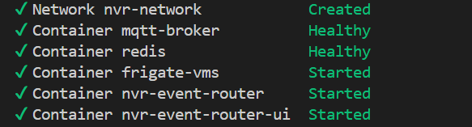

# Smart NVR - Getting Started

## Overview

Smart NVR is a GenAI-powered video analytics application that enhances traditional network video recorders with intelligent event detection and real-time insights at the edge. This guide will help you quickly deploy and configure the application to start extracting valuable insights from your video data.

## Prerequisites

### System Requirements
- System must meet [minimum requirements](./system-requirements.md)
- Docker installed ([Installation Guide](https://docs.docker.com/get-docker/))
- Docker configured to run without sudo ([Post-install guide](https://docs.docker.com/engine/install/linux-postinstall/))
- Git installed ([Installation Guide](https://git-scm.com/book/en/v2/Getting-Started-Installing-Git))

### Required Services
Ensure these services are running before setting up Smart NVR:

- **VLM Microservice**: Must be running on a device connected to the NVR
- **VSS (Video Search and Summarization) Services**:
  - **VSS Search**: Running on one device for video search functionality
  - **VSS Summary**: Running on a separate device for video summarization
  - 📖 [VSS Documentation](https://github.com/open-edge-platform/edge-ai-libraries/blob/main/sample-applications/video-search-and-summarization/docs/user-guide/get-started.md)

## Quick Start

### 1. Clone the Repository

```bash
git clone https://github.com/open-edge-platform/edge-ai-suites.git
cd edge-ai-suites/metro-ai-suite/smart-nvr
```
> **Note**: This release uses a build script that directly builds the Docker images. Follow the [setup process](./how-to-build-from-source.md) to build the image before running the application.

### 2. Configure Environment Variables

Set up the required environment variables:

```bash

# Video Search and Summarization Services
export VSS_SUMMARY_IP=<vss-summary-ip>         # Required
export VSS_SUMMARY_PORT=<vss-summary-port>     # Required (typically 12345)
export VSS_SEARCH_IP=<vss-search-ip>           # Required
export VSS_SEARCH_PORT=<vss-search-port>       # Required (typically 12345)

# VLM Model Endpoint
export VLM_SERVING_IP=<vlm-serving-ip>             # Required
export VLM_SERVING_PORT=<vlm-serving-port>         # Required (typically 9766)

# MQTT Configuration
export MQTT_USER=<mqtt-username>               # Required
export MQTT_PASSWORD=<mqtt-password>           # Required

```

### 3. Start the Application

Launch all services using the setup script:

```bash
./setup.sh start
```

This will start all required services as shown below:



### 4. Access the Application

Open your browser and navigate to:
```
http://<host-ip>:7860
```

### 5. Stop the Application

To stop all services:

```bash
./setup.sh stop
```

## Next Steps

- **Troubleshooting**: Check the logs of individual services if you encounter issues. More information is present [here](./support.md#troubleshooting-docker-deployments),


---