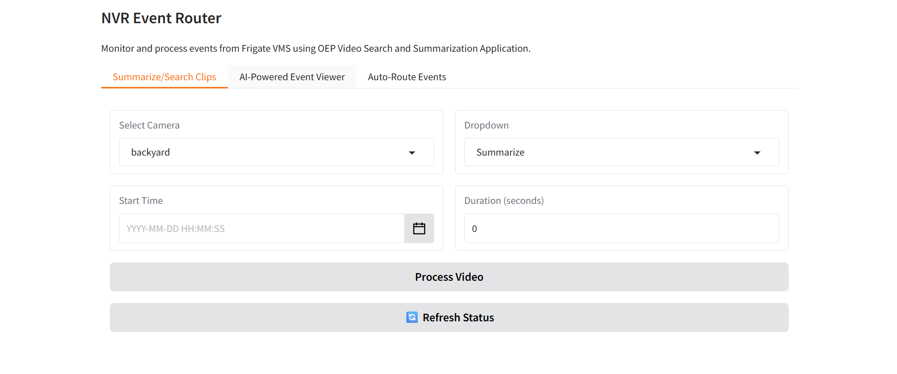
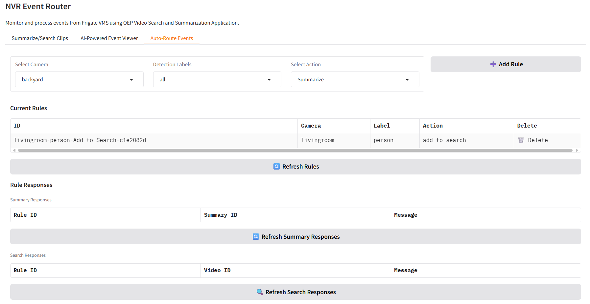

# How to Use the Application

Once deployed,this guide will help you:
- Verify that the application is running correctly.
- Access the application's features and user interfaces.
- Understand how to interact with the various components of the Smart Intersection Sample Application.

By following this guide, you will be able to explore the application's capabilities

## **Access the Application and Components** ##

### **Application UI** ###

Open a browser and go to the following endpoints to access the application. Use `<actual_ip>` instead of `localhost` for external access:

- **URL**: [https://localhost:7860](https://localhost:7860)

> **Notes**:
> - After starting the application, wait approximately 1 minute for the MQTT broker to initialize. You can confirm it is ready when green arrows appear for MQTT in the application interface. Since the application uses HTTPS, your browser may display a self-signed certificate warning. 
> - For the best experience, it is recommended to use **Google Chrome**.

## Verify the Application
Once the application is deployed accessing the application will look something like below:

There are three functionalities of this application:

1. **Summarise/Search** clips which is the above screenshot.
2. **AI powered event viewer** where we can get a brief summary of the object being detected in the video.

3. **Auto Route** events where we can create rules as according to our needs.

## Resources

- **[Troubleshooting Guide](./support.md)**: Find detailed steps to resolve common issues during deployments.
- **[Get Started](./get-started.md)**: Ensure you have completed the initial setup steps.
- **[Deploy Using Script](./how-to-build-from-source.md)**: Ensure you have built and deployed the application 
